# Digital FTE - Personal AI Employee

> Your AI-powered personal assistant for file processing and task management.

---

## Quick Navigation

| | |
|:---:|:---:|
| [[Dashboard\|📊 Dashboard]] | [[Inbox\|📥 Inbox]] |
| [[Needs_Action\|⚡ Pending]] | [[Done\|✅ Completed]] |
| [[Plans\|📋 Plans]] | [[Company_Handbook\|📖 Handbook]] |

---

## How It Works

```mermaid
graph LR
    A[📁 Drop File] --> B[📥 Inbox]
    B --> C[👁️ Watcher Detects]
    C --> D[⚡ Needs_Action]
    D --> E[🤖 Claude Processes]
    E --> F[✅ Done]
```



### 1. Drop Files
Place any file in the **[[Inbox]]** folder - documents, images, data files, anything.

### 2. Automatic Detection
The file watcher automatically detects new files and creates action items.

### 3. AI Processing
Run Claude to process items according to your **[[Company_Handbook|rules]]**.

### 4. Review Results
Check the **[[Dashboard]]** for status and completed items in **[[Done]]**.

---

## Getting Started

### Start the Watcher
```bash
cd /Volumes/Macintosh\ HD/DigitalFTE
uv run python watchers/filesystem_watcher.py
```

### Process Pending Items
```bash
claude "Process all items in AI_Employee_Vault/Needs_Action"
```

### Or Use Skills
```bash
claude /process-inbox
claude /update-dashboard
```

---

## Today's Summary

```dataview
LIST WITHOUT ID
  "📥 " + length(filter(file.lists, (l) => contains(l.text, "Inbox"))) + " files in Inbox" +
  " | ⚡ " + length(filter(file.lists, (l) => contains(l.text, "pending"))) + " pending"
FROM "Dashboard"
LIMIT 1
```

| Metric | Value |
|--------|-------|
| Pending Items | `$= dv.pages('"Needs_Action"').where(p => p.status === 'pending').length` |
| Completed Today | `$= dv.pages('"Done"').where(p => p.file.cday.equals(dv.date('today'))).length` |

---

## Quick Drop Zone

> [!tip] Drag & Drop Files Here
> You can drag files directly onto this note in Obsidian.
> They will be saved to the Inbox folder automatically.

---

## Recent Activity

```dataview
TABLE WITHOUT ID
  file.link as "Item",
  status as "Status",
  file.mtime as "Last Modified"
FROM "Done" OR "Needs_Action"
SORT file.mtime DESC
LIMIT 5
```

---

## Resources

- [[Company_Handbook|📖 Processing Rules & Boundaries]]
- [[Templates/Action File|📄 Action File Template]]
- [[Templates/Plan|📋 Plan Template]]

---

*Digital FTE - Bronze Tier v1.0*
